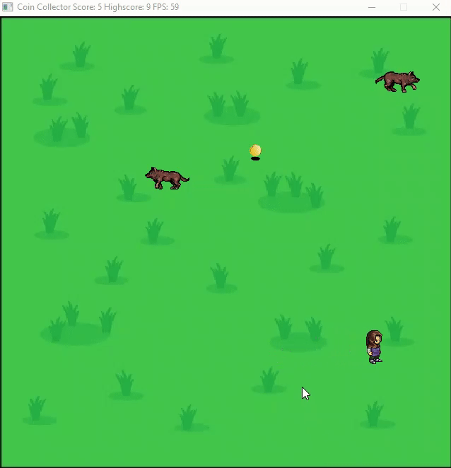

# CppND Capstone Project - SDL-2D-Game: Coin Collector

## About
This game is based on the 2D Snake game. The premise of the game is that the player is the **hero** whose objective  is to collect as many **coins** as possible. The villians in this scenario are the **wolves** who would eat the hero if their paths crossed. Hence it is vital to avoid the path of the wolves; the hero dies and the game ends if his coordinates intersects with those of the wolves. 

---
<p align="center">

</p>

---

### Game Features:
+ **Controls:**
    The hero can move in four directions: up, down, left and right, and can be controlled using the respective arrow keys.
    * Up: &#8593; 
    * Down: &#8595;
    * Left: &#8592;
    * Right: &#8594;

+ The hero has an initial speed that gradually increases with every coin collected, hence increasing the difficulty of the game as your score becomes higher.
+ The wolves follow a random path, periodically changing its direction using the '*Mersenne Twister 19937 generator*' to generate a direction. Initailly there is only one wolf to worry about, but after collecting a certain number of coins (set to 5 currently), another wolf is introduced; thereby enhancing the difficulty of the game.
+ Another factor that increases difficulty is that the wolves gradually increase their speed after every 5 coins collected.
+ The game has the feature to store your highscore and is displayed on the window title while the game is running.
+ When the hero dies and the game ends, a 'message box' pops up giving the player the option to either **restart** or **quit** the game. 

## Requirements
### Dependencies for Running Locally
* cmake >= 3.7
  * All OSes: [click here for installation instructions](https://cmake.org/install/)
* make >= 4.1 (Linux, Mac), 3.81 (Windows)
  * Linux: make is installed by default on most Linux distros
  * Mac: [install Xcode command line tools to get make](https://developer.apple.com/xcode/features/)
  * Windows: [Click here for installation instructions](http://gnuwin32.sourceforge.net/packages/make.htm)
* gcc/g++ >= 5.4
  * Linux: gcc / g++ is installed by default on most Linux distros
  * Mac: same deal as make - [install Xcode command line tools](https://developer.apple.com/xcode/features/)
  * Windows: recommend using [MinGW](http://www.mingw.org/)

### Libraries
* SDL2 >= 2.0
  * All installation instructions can be found [here](https://wiki.libsdl.org/Installation)
  * Note that for Linux, an `apt` or `apt-get` installation is preferred to building from source.; download the        development version. 
  * On linux you can do this typing the following command on the terminal:

    ```bash
    sudo apt-get install libsdl2-dev
    ```
* The SDL2_image library >= 2.0.5
    * For Winodws users, you can download the library from [here](https://www.libsdl.org/projects/SDL_image/) ; again download the development version.
    * Linux users can simply run the following command,

    ```bash
    sudo apt-get install libsdl2-image-dev
    ```
---
**NOTE :** (For Windows Users)

To run the SDL game on Windows, you may need to copy and paste all the `.dll` extension files into your project directory if you have downloaded the package directly without using a package manager.

---

## Steps for running
### On Linux devices: (with CMakeLists)
1. Go to project directory. Create a build directory by typing the command: 
    ```bash 
    mkdir build
    ``` 
2. Go into the build directory,
    ```bash
    cd build
    ```
3. Type the following command to terminal,
    ```bash
    cmake ..
    ```
4. Run the make command:
    ```bash
    make
    ```
5. Execute `./CoinCollector`

### On Windows devices using MinGW: (with Makefile)
1. Go to directory where files are located.
2. run `make` command
3. execute `./CoinCollector.exe`

